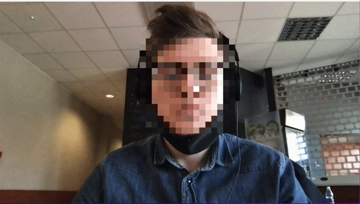

# Face Blur

Simple python script for blurring face using haarcascade frontalface.
## Installation

Clone repository
```bash
git clone https://github.com/rostekus/face_blur_cv2
cd face_blur_cv2
```
Install requirements
```bash
pip install requirements.txt
```
Setup up
```bash
python3 setup.py install
```

## Usage
```bash
python3 face_blur.py
```
#### Example


## License
[MIT](https://choosealicense.com/licenses/mit/)
